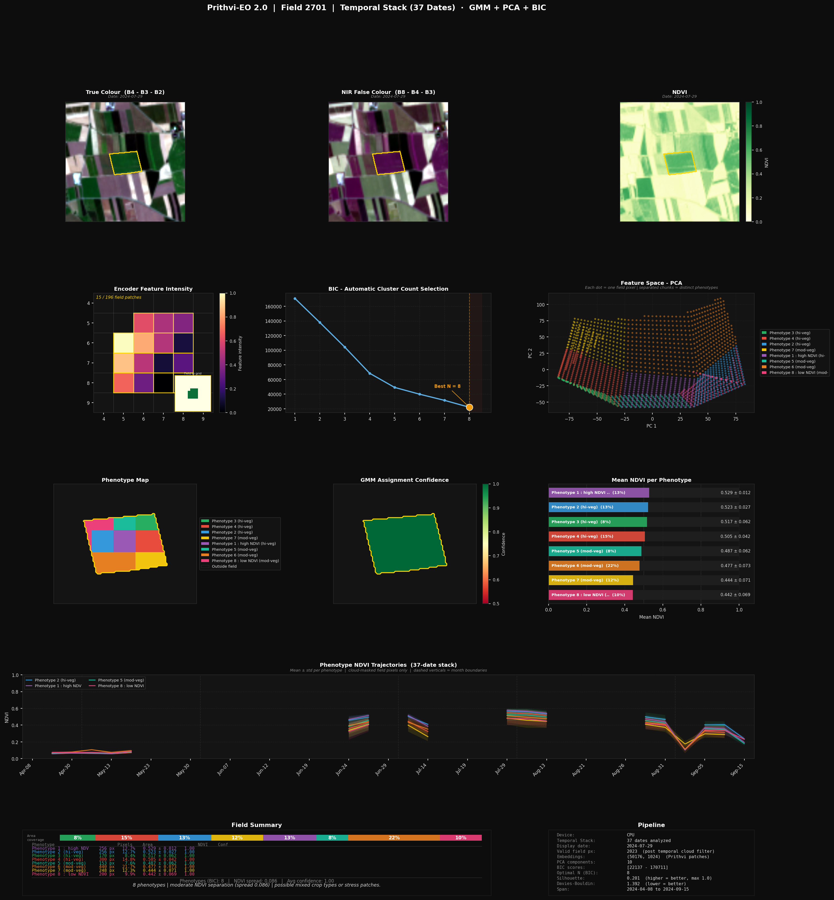

# Earth Observation using Prithvi EO 2.0

### Temporal Crop Analysis & Multi-Cropping Detection with Foundation Models

This project builds a **full temporal Earth Observation pipeline** using **Prithvi EO 2.0 + spectral features + temporal statistics + unsupervised learning** to analyze **intra-field crop variability (multi-cropping / stress zones)**.

The main objective is to detect and understand **multi-cropping patterns within agricultural fields**, identify crop variability, and analyze field-level growth behavior across time using satellite imagery and foundation model embeddings.

The pipeline is designed for:

- Temporal crop behavior analysis
- Multi-cropping detection
- Phenotype discovery inside fields
- Agricultural field screening at scale
- Temporal consistency analysis
- Interpretable agricultural AI workflows

---

## (Latest Version)

Temporal stack (multi-date satellite data)

Cloud & shadow masking (SCL + spectral fusion)

Temporal NDVI + embedding statistics

Automatic cluster selection using **BIC**

Phenotype-based field analysis (instead of simple clusters)

Temporal NDVI trajectory visualization

Per-date clustering analysis

Batch field processing pipeline

Field-level screening & ranking

CSV-based summaries and reports

Custom dashboard visualization system

Strong interpretability + confidence estimation

GeoTIFF export for GIS workflows

---

## Key Idea

Instead of analyzing a **single snapshot**, this project uses:

* **Prithvi EO embeddings (deep features across time)**
* **Spectral indices (NDVI, NDWI, SAVI, NDRE)**
* **Temporal statistics (growth patterns, variability)**
* **Spatial information**

to identify **hidden patterns inside fields**, such as:

* Multiple crops (multi-cropping)
* Growth differences
* Stress zones
* Temporal crop behavior changes
* Stable vs unstable phenotypes
* Seasonal transitions

---

## Sample Outputs

### Temporal Dashboard



### Dashboard shows:

* RGB & NIR views (best cloud-free date)
* NDVI map (vegetation health)
* Encoder feature intensity
* BIC-based cluster selection
* PCA feature space
* Phenotype map (crop zones)
* Confidence map
* Mean NDVI per phenotype
* Temporal NDVI trajectories (37 dates)
* Final field summary

---

### Per-Date Phenotype Grid


This dashboard visualizes:

* Phenotype maps for each individual date
* Temporal evolution of field structure
* Cluster consistency across the season
* Seasonal transitions and growth behavior
* Date-wise cluster separability

---

### Batch Screening Summary


Batch analysis includes:

* Field-level ranking
* Multi-cropping likelihood
* Cluster statistics
* NDVI separability
* Temporal consistency scores
* Field screening summaries

---

## Pipeline Overview

```text
Multi-Date Satellite Data (T × 6 bands)
        ↓
Cloud & Shadow Masking (SCL + Spectral)
        ↓
Temporal NDVI Computation
        ↓
Temporal Composite (best clear pixels)
        ↓
Prithvi EO 2.0 Encoder
        ↓
Patch Tokens (per date)
        ↓
Temporal Embedding Statistics
        ↓
Upsampling → Pixel Features
        ↓
Feature Fusion:
   [Embeddings + Temporal + Spectral + Spatial]
        ↓
PCA (Dimensionality Reduction)
        ↓
GMM Clustering (with BIC selection)
        ↓
Phenotype Mapping + Confidence
        ↓
Per-Date Clustering Validation
        ↓
Temporal Analysis + Visualization
        ↓
Batch Screening + CSV Reports
        ↓
Dashboard + GeoTIFF Export
````

---

## Project Structure

```bash
.
├── main.py                    # Main temporal analysis pipeline
├── start.py                   # Entry script
├── batch_pipeline.py          # Batch processing across multiple fields
├── full_pipeline_only.py      # Full pipeline execution mode
├── screening.py               # Field screening & ranking
├── field_classifier.py        # Field-level classification logic
│
├── config.py                  # Configuration and parameters
├── data_loader.py             # Temporal chip & metadata loading
├── extractors.py              # Feature extraction utilities
├── metrics.py                 # Clustering & evaluation metrics
│
├── cloud_mask.py              # SCL + spectral cloud masking
├── spectral.py                # Spectral indices & composites
├── encoder.py                 # Prithvi embeddings + temporal stats
├── clustering.py              # PCA + GMM + BIC clustering
├── per_date_clustering.py     # Per-date clustering analysis
│
├── visualization.py           # Dashboard generation
├── panels.py                  # Visualization panel components
├── theme.py                   # Dashboard styling & themes
├── batch_report.py            # Batch report & CSV generation
│
├── export.py                  # GeoTIFF export
├── modelfactory.py            # Prithvi model loading
├── qgis_chip_extractor.py     # Sentinel-2 chip extraction (QGIS)
└── __init__.py
```

---

## Core Components

### Cloud & Shadow Masking

* Combines:

  * Sentinel-2 SCL labels
  * Spectral thresholding

* Ensures only **clean pixels are used**

* Robust fallback when SCL is unavailable

This improves temporal consistency and prevents cloud contamination from affecting clustering results.

---

### Spectral Processing

* Computes:

  * NDVI (vegetation)
  * NDWI (water)
  * SAVI (soil-adjusted vegetation)
  * NDRE (red-edge proxy)

* Builds temporal composite imagery using the **greenest cloud-free pixels**

This helps preserve the most informative vegetation signals across the season.

---

### Prithvi EO Encoder

* Processes **multi-temporal satellite stacks**

* Extracts:

  * Patch embeddings (per date)
  * Temporal embedding statistics:

    * mean
    * standard deviation
    * temporal range

These embeddings serve as the deep feature backbone of the project.

---

### Temporal Feature Engineering

* NDVI trajectories per pixel
* Growth patterns across the season
* Embedding variability over time
* Temporal stability analysis
* Per-date feature consistency

This helps distinguish crop behavior beyond what a single image can show.

---

### Clustering (Core Logic)

* Feature fusion:

```text
Embeddings + Temporal + Spectral + Spatial
```

* PCA for dimensionality reduction

* **GMM clustering with automatic BIC selection**

* Quality metrics:

  * Silhouette score
  * Davies-Bouldin index
  * Cluster confidence estimation
  * Temporal consistency scoring

This creates a fully adaptive and robust clustering pipeline.

---

### Phenotype Mapping

Instead of raw clusters → meaningful **phenotypes**

Examples:

* High NDVI → healthy crop zones
* Low NDVI → stress / weak growth
* Mixed patterns → possible multi-cropping
* Temporal instability → abnormal growth behavior

This improves interpretability for real agricultural decision-making.

---

### Per-Date Clustering Analysis

The system also performs clustering across individual dates to validate:

* temporal consistency
* cluster stability
* seasonal crop transitions
* temporal separability

This helps verify whether patterns remain stable or change significantly over time.

---

### Batch Screening Pipeline

The project now supports large-scale field analysis through batch processing.

Features include:

* Automated processing of multiple fields
* Summary CSV generation
* Multi-cropping ranking
* Field-level phenotype comparison
* Statistical screening metrics
* Batch dashboard generation

This enables scalable agricultural monitoring workflows.

---

### Visualization System

The visualization pipeline is modular and dashboard-oriented.

Features include:

* Multi-panel dashboard layouts
* Phenotype comparison panels
* Temporal trajectory visualization
* Cluster confidence visualization
* Batch summary dashboards
* Per-date phenotype grids
* Consistent dashboard styling system

---

### Temporal Analysis

Tracks:

* NDVI evolution over time
* Growth differences between zones
* Phenotype-specific crop trajectories
* Temporal consistency of clusters

Key insight:

> Same field ≠ same behavior over time

This is one of the strongest research contributions of the project.

---

### GeoTIFF Export

Exports:

* Band 1 → phenotype labels
* Band 2 → confidence values

Ready for:

* QGIS
* ArcGIS
* GIS-based agricultural workflows

---

## Example Insights

The system can detect:

* **Multi-cropping within a field**
* **Stress zones vs healthy regions**
* **Growth differences over time**
* **Weak vs strong spectral separation**
* **Phenotype consistency across dates**
* **Temporal crop transitions**
* **Potential abnormal growth behavior**

Example outputs:

* NDVI gap between phenotypes
* Cluster distribution (%)
* Confidence scores
* Temporal NDVI curves
* Seasonal growth comparisons
* Batch screening rankings
* Field summary CSV reports
* Per-date phenotype evolution

---

## Configuration

```python
FIELD_ID = 2701

DATES = [...]   # 37 temporal observations

MAX_CLUSTERS = 8
PCA_COMPONENT = 10

CHIP_SIZE = 224
PATCH_GRID = 14
```

---

## How to Run

### 1. Install dependencies

```bash
pip install numpy torch scikit-learn matplotlib rasterio pandas
```

### 2. Run single-field pipeline

```bash
python main.py
```

### 3. Run batch field processing

```bash
python batch_pipeline.py
```

### 4. Generate reports

```bash
python batch_report.py
```

---

## Generated Outputs

The pipeline generates:

* Temporal analysis dashboards
* Per-date phenotype grids
* Batch screening visualizations
* GeoTIFF exports
* CSV summaries
* Cluster statistics
* Temporal trajectory analysis
* Field ranking reports
* Phenotype consistency analysis

---

## Highlights

* Foundation model usage (**Prithvi EO 2.0**)
* Temporal + spatial + spectral feature fusion
* Fully unsupervised learning pipeline
* Automatic cluster count selection using BIC
* Strong interpretability and explainability
* Real-world agricultural application
* Works on Sentinel-2 satellite imagery
* Temporal crop behavior modeling
* GIS-compatible outputs
* Multi-cropping detection pipeline
* Batch-scale agricultural field screening
* Modular visualization & reporting system

---

## Future Improvements

* Supervised crop classification (if labels become available)
* Multimodal fusion (weather + soil + sensor data)
* Deep clustering / self-supervised learning
* Real-time monitoring system
* Streamlit dashboard deployment
* Integration with precision agriculture decision systems
* Temporal anomaly detection
* Interactive GIS visualization

---

## Acknowledgements

* IBM & NASA – Prithvi EO 2.0
* Open-source geospatial ML ecosystem
* Greenspin GmbH (Würzburg) for providing data, infrastructure, imagery, and domain support during the internship

---

## Author

**Sudipto Chakraborty**

MSc Aerospace Informatics

University of Würzburg

---
If you like this project, give it a ⭐ 
